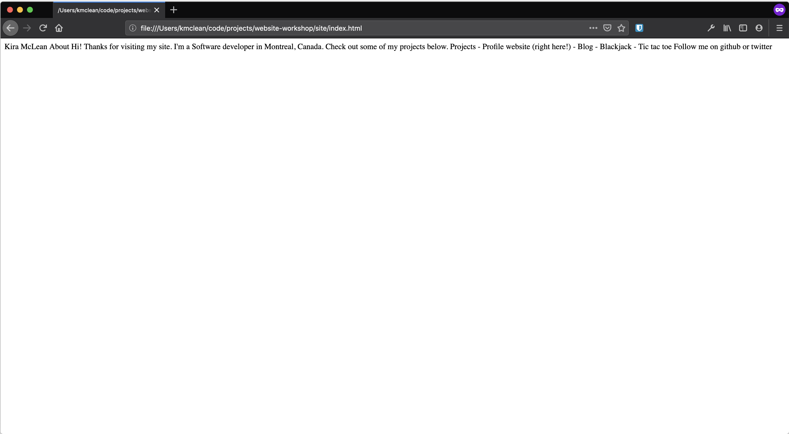

# Intro

This is a tutorial to walk you through building your first website. We'll walk through building a simple personal profile page together, where you can showcase all the projects you complete as you learn to code, this being your first one! You can see an overview of this tutorial covers via the outline.

## Who is this for?

This tutorial is meant for people who have no background or experience with programming or web development. It was originally developed to give at a learnathon  for high school and recently-graduated-from-high-school students.

It will assume absolutely no knowledge of the internet, web development, or any of the topics, languages, or concepts contained in this tutorial.

If you already know how to code or how to make websites, you might find this pretty boring. That being said, if you are used to building complicated web apps or non-web-based software, you might find it interesting to follow along at a faster pace to see what the minimum requirements and basic principles are for making a simple, minimalist static website.

## Following along

Throughout the tutorial you'll see links to tagged commits on GitHub that say something like "See example here" [TODO: put whatever standard thing I came up with here]. Don't worry if you don't know what git or GitHub or commits are, just know that those are links to an example online of what your project should look like at that point.

If something isn't working the way you expect it to or if you're having trouble getting through a particular step, have a look at the link.

It's not cheating to look at good examples of how something is done. It's completely ok if that's how you learn best. The example website included with this tutorial is meant to be a helpful guide to keep you on track and help you get unstuck. You won't learn much if you just copy it, but the goal here isn't to have something to submit at the end of the tutorial, it's to _learn_ how to make a website. How much effort you put into learning  and how honest you are about trying to learn vs. just copying the answer is completely up to you.

## Feedback and suggestions

If you have feedback or suggestions for how to improve this tutorial, I would love to know about them! My goal is for it to be a useful resource for people who are brand new to web development. I've been making websites for a while now and it's easy for me to forget what was and wasn't obvious when I was first learning. If there's something you think could be made more clear, I would love to hear your feedback and use it to improve future versions of this for others.

You can reach me on twitter as [@kiraemclean](https://twitter.com/kiraemclean) for quick comments, or make an issue [TODO: link this] in the GitHub repository for this tutorial to share your feedback.

Let's get started!

# Background

## What is a website?

A website is really just some files on someone else's computer that have an address on the internet. Every file gets its own globally unique address (its URL -- "Uniform Resource Locator"), and your browser knows how to find what lives at that address and render it for you.

We'll worry about how to put our files on the internet later, for now we'll just make a website out of files that only exist on our computer.

Websites are made up of many files that are linked together, and websites can link to other websites, which make up the internet.

## Static vs. Dynamic websites

What I just said about websites being just some files on someone else's computer isn't exactly the whole story. There are some websites where every page is generated "on the fly", i.e. on demand at the time it's requested. Sort of like your bank account balance -- the bank doesn't just have a single place to look when someone asks "How much money is in my account?" First they have to identify the person who's asking, go look for the right account, then they can tell you the current number. It will probably be a different number next time you come, and it will be different depending who asks for it.

This is different from a file that stays the same and looks the same for every person, sort of like the bank's account terms and conditions. You're going to get the same answer every time you ask for it and it'll be the same for every person. We think of this as "static" content. Static websites are like that -- they look the same no matter who's asking and if you ask for the same thing a bunch of times, you'll see the same thing every time. This is the kind of website we're going to build.

# Setup

## Website skeleton

To get started, make a new folder for your project -- you can name it whatever you want, something like `site` would make sense. That's what mine is called in the example you can follow along with. 

Next open up a text editor. We need one that just works with plain text files and doesn't apply formatting or styling like in Word. Your computer will probably have one built in, like Notepad if you're on Windows, or TextEdit if you're on macOS. Feel free to use a different one if you already have it and like it better, those are just examples of ones you probably already have.

Now from this editor make a new file inside of our new folder called `index.html`. _It's important that the file is called exactly `index.html`_. 

At this point, your project should have this structure:

```
site
└── index.html
```

Just a single folder with a single empty file called `index.html` inside, like the [example here](https://github.com/kiramclean/website-workshop/tree/1-initial-setup/site).

### Why does the name matter?

When you first visit a website, normally you don't specify the name of the file you're looking for. We just type things `https://mozilla.org` into our browsers, not the full location for a file, like `https://mozilla.org/firefox`. When a browser sees that you haven't specified the name of a file, it will check for a file called `index.html` by default, which is why it's important that our file has the right name.

## Open your file

_Technically_, this is already enough for a website. Open up your `index.html` in a browser and check it out. There are a few ways to open an html file in your browser:

- Click and drag it from your file browser into a web browser
- Double click the file from your file browser
- Right click the file from your file browser and choose "Open with" and select a web browser

These might not all work the same on every operating system, but it doesn't matter how you open your web page, just that we can see it in the browser.

## Content

You should just see a blank page. We can add some content to our page and it will render just fine in a browser without needing to write any code at all. To get started, write your name, a little intro, and a list of projects in your file, so it looks something like this:

```
Kira McLean

About
Hi! Thanks for visiting my site. I'm a Software developer in Montreal, Canada. Check out some of my projects below.

Projects
- Profile website (right here!)
- Blog
- Blackjack
- Tic tac toe

Follow me on github or twitter
```

You could write whatever you want here, but we'll go ahead with this content for now.

If you want to just grab some placeholder text to move on and worry about the actual content later, grab the text from the [example here](https://github.com/kiramclean/website-workshop/blob/2-content/site/index.html).

To see what your website looks like so far, click and drag the file from your file explorer to your browser. It should look something like this. Not very impressive, eh?



### Formatting

You'll notice that all the text is just showing up in one line. This is because the browser doesn't care about spaces or new lines in our file. The spacing and formatting of an HTML file isn't determined by the spacing or formatting of the text in the source file, like it is for other text document formats.

# HTML

Now we'll get started writing some code.

## What is HTML?

HTML is a markup language used to semantically describe content. It's used to annotate normal text, like what we just wrote, so that browsers can display it in a way that makes sense.

HTML wraps pieces of content in "tags", which give browsers information about how render the text. A tag starts with `<` or `</` and ends with `>`. When we say something is "wrapped" in a tag, that means there's an "opening tag", which is one that starts with `<` before it, and a closing tag, which is one that starts with `</` after it. 

Don't worry if that doesn't make sense yet, we'll see what it looks like in context next.

## Plain text to html

All HTML pages have a few things in common. The first thing at the beginning of an html document is a message to the browser about what kind of document it is, which looks like this: `<!DOCTYPE html>`. This is really a historical artifact from the early days of the internet when we had to give browsers information about what kind of content to expect, because there multiple different versions of HTML in use. These days all you really need to know is that valid HTML documents start with that tag at the very top, which is sometimes called a "doctype declaration".

The second thing all HTML documents have in common is that _all_ the content is wrapped in an `<html></html>` tag. This is called the "root" element, and it tells the browser that this is the beginning of our html content.

Turn your plain text document into an HTML document by adding a doctype declaration to the top and wrapping the rest of the content in the `<html></html>` tag, like [this]():

```html
<!DOCTYPE html>
<html>
  Kira McLean

	About
	Hi! Thanks for visiting my site. I'm a Software developer in Montreal, Canada.
  Check out some of my projects below.

	Projects
	- Profile website (right here!)
	- Blog
	- Blackjack
	- Tic tac toe

	Follow me on github or twitter
</html>
```

### Formatting

You'll notice that I indented all the content one level so that it's clear that it's _inside_ the `<html></html>` tag. This is how HTML should be structured in a file, so it's a good practice to pick up right now. It makes our code much easier to read once there are more tags.

Remember that the spacing of the content inside your text file doesn't affect how the browser renders it. We'll learn more about how to change the way your content looks in a bit. 

## HTML `head`

The next thing all HTML documents have in common is that the next piece of information the browser gets after the doctype declaration is the `<head></head>` tag. This part of an HTML document contains metadata about the page you're looking at. In this case metadata means information that the browser needs in order to render the page properly, but that doesn't need to be rendered for users to see.

There are loads of possible things you can put in the `<head></head>` of an HTML document, but there are at least two that you should always include.

### Title

This will be show up as the title of the browser tab and is what your web page will be called if someone bookmarks your web page. It looks like this: `<title>This is my title</title>`.

### Character set

You should always include a `<meta>` tag with a `charset` attribute. HTML tags can have attributes, which are extra information that's relevant to that particular tag. A valid meta tag to put in the `<head></head>` of your HTML document looks like this: `<meta charset="utf-8">`.

This is there to tell the browser which character set to use. It's not super important to understand what that means, but it has to do with telling the browser how to render the text that it finds in your file. 

In the early days of programming not everybody translated the letters we understand into the numbers that computers understand the same way, and "character encoding" is a whole topic around sorting that out. It won't come up again for us, we just need to make sure to include this tag in our pages. 

Pretty much all web pages use "utf-8" encoding now because it supports the widest range of characters.

### Valid HTML `head`

All of this adds up to a valid HTML `head` tag, and our document should look like this now:

```html
<!DOCTYPE html>
<html>
	<head>
		<meta charset="utf-8">
		<title>Kira McLean</title>
	</head>
  Kira McLean

	About
	Hi! Thanks for visiting my site. I'm a Software developer in Montreal, Canada. 		Check out some of my projects below.

	Projects
	- Profile website (right here!)
	- Blog
	- Blackjack
	- Tic tac toe

	Follow me on github or twitter
</html>
```


## Closing HTML tags


